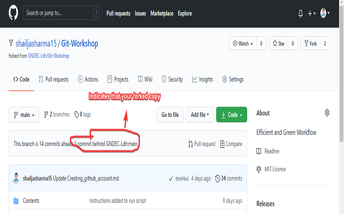

# SYNCHRONIZING FORK REPOSITORY

When you work jointly on a file of any kind like notice, project etc, there may be a situation that changes that are done to the head repository (from which you forked repository) are not present in your copy. There is a need to update the fork before continuing.

Github has an excellent feature. There is no need to manually check whether your fork is up to date or not. It is done automatically. As soon as you open repository it shows notification: 

``` you are n number of commit behind ```



It indicates that your fork is not up to Date. Now, synchronize your fork by following steps:

- Click on Compare changes


- Click on compare across forks. Choose your repository i.e your_username/repository in base and other-username/repository name in head. 


- Write the title of pull request. It's just a text to indicate actually what was changed. This text has no effect on changes.This page also shows exactly what changed has been done and on which file.


- If branch has no conflict then it shows the option of Merge Pull request. Click on it.


- Now review the changes and click on confirm Merge.


